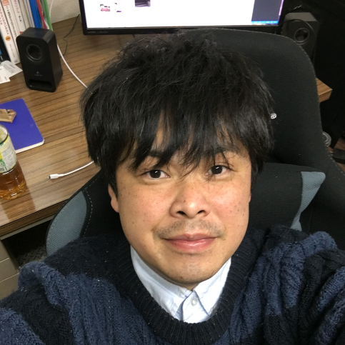

# Portfolio(sealddr)

## About me

I'm ICT architect living in Osaka, Japan.
I'm good at leaving new knowledge in the frontier.

My nickname is `sealddr`, since
I'm so obese that I look like seals,
and I'm eager to playing DDR (The dance simulation game published by
[Konami Digital Entertainment](https://www.konami.com/games/jp/ja/)).
My real name is `Masakazu Kadoshita`

## Favorites

### Teches

| Name                                                              | Description                       | Why favorite?                                                              |
| :---------------------------------------------------------------- | :-------------------------------- | :------------------------------------------------------------------------- |
| [AtCoder](https://atcoder.jp/users/SEALDDR)                       | A Programming Competition Service | I like to invent algorithms.                                               |
| [Elasticsearch](https://www.elastic.co/elasticsearch)             | A Search engine software          | I've hacked apache Lucene, which Elasticsearch is based on                 |
| [HYPERLEDGER-FABRIC](https://www.hyperledger.org/projects/fabric) | A Distributed ledger software     | I assume that the blockchain system will become popular among consortiums. |
| [graph theory](http://diestel-graph-theory.com/index.html)        | A mathematical domain.            | My research theme in the lab of the university                             |

### Hobbies

| Name                                        | Description                                                                                                 | Why favorite?                                                 |
| :------------------------------------------ | :---------------------------------------------------------------------------------------------------------- | :------------------------------------------------------------ |
| DanceDanceRevolution                        | A series of game contents published by [Konami Digital Entertainment](https://www.konami.com/games/jp/ja/)) | A quarter of my life are consisted by this.                   |
| [iDOLM@STER series](https://idolmaster.jp/) | A series of game contents published by [BANDAI NAMCO](https://www.bandainamcoent.co.jp/english/)            | In fact, it is my main work to run the produce of idols.      |
| [HANSHIN Tigers](https://hanshintigers.jp/) | A baseball team in NPB                                                                                      | I've been familiar with this them from the moment I remember. |
| [Nana Mizuki](https://www.mizukinana.jp/)   | A voice actress                                                                                             | She gives us much courage and bravery to survive.             |

## Qualifications

### Operating Systems

| Item                           | Duration | Description                                                                                                       |
| :----------------------------- | :------- | :---------------------------------------------------------------------------------------------------------------- |
| Windows 7 / 8.1 / 10           | 12 years | I could develop VB scripts, powershell scripts and windows batches.                                               |
| Windows Server 2003r2 - 2012r2 | 9 years  | I could set up the domain controller.                                                                             |
| Linux(RedHat/CentOS)           | 9 years  | I could make installation, build httpd, build cron scripts, set firewall, and deploy applications to the servers. |

### Programming languages

| Name           | Duration | Description                                                                                 |
| :------------- | :------- | :------------------------------------------------------------------------------------------ |
| C++            | 1 years  | Now I'm participating in the programming contests in C++                                    |
| JavaScript     | 2 months | Now I'm developing my portfolio products in HTML, CSS and this                              |
| Go             | 1 months | I've just finished go tutorials                                                             |
| PHP            | 2 months | I used this language with Cake PHP framework to develop web application for high school     |
| Java 6 / 7 / 8 | 9 years  | The most familiar language I have ever written                                              |
| C              | 6 years  | The first language I had learned                                                            |
| Scala          | 3 months | I defined my original DSL(Domain Specified Language) and developed the interpreter in Scala |
| Python         | 6 months | I developed system operation scripts in Python (version 2.x)                                |

### Frameworks

To Be Added

### Databases

To Be Added

## DevOps

ToBe Added

### Others

To Be Added

## Products

### Visualization of algorithms

To Be Added

## Publications

### GitHub

[My GitHub account](https://github.com/sealddr)

### Blog

[SEAL's home](https://sealddr.wordpress.com/)

### Thesis

[Tractability and Intractability of Problems on Unit Disk Graphs Parameterized by Domain Area,
Hiro Ito, Masakazu Kadoshita, ISORA2010](http://www.aporc.org/LNOR/12/ISORA2010F16.pdf)

## Work Experience

| Duration     | Company                                              | Department           | Position                |
| :----------- | :--------------------------------------------------- | :------------------- | :---------------------- |
| 2017-present | [Zitte](http://www.zitte.co.jp/company.html)         | Technical department | System engineer         |
| 2015-2017    | [NIT](https://www.nit2008.com/)                      | Technical department | manager                 |
| 2014-2014    | YMS                                                  | Technical department | Chief engineer          |
| 2010-2013    | [NSSOL Corp.](https://www.nssol.nipponsteel.com/en/) | Systems R&D Center   | Chief researcher        |
| 2008-2010    | [NSSOL Corp.](https://www.nssol.nipponsteel.com/en/) | Systems R&D Center   | Deputy chief researcher |

## Education

### Graduated

[Master of Informatics, Kyoto University, Kyoto, Japan](http://www.i.kyoto-u.ac.jp/en/)

### major in

Area of Logic Circuits, Algorithms, Discrete structures, Complexity,
Course of Computer Engineering,
[Department of Communications and Computer Engineering](http://www.cce.i.kyoto-u.ac.jp/course-e.html)

## Contact

Twitter : [@seal_ddr](https://twitter.com/SEAL_DDR)

E-mail : [[Business Use](mailto:mkadoshita@gmail.com)] [[Private Use](mailto:seal0511ddr@gmail.com)]

---

&copy; sealddr All rights reserved.
